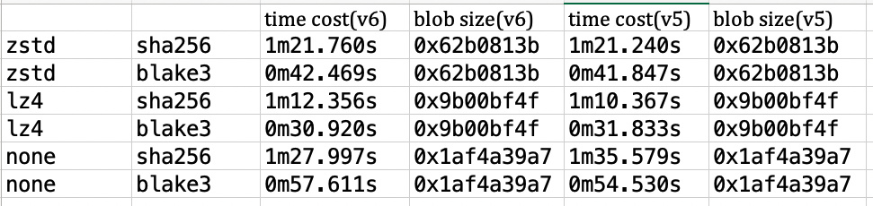

# Registry Accelerated File System

There is a common pattern in software distribution where software vendors publish read-only packages to a repository/registry, and end users download these packages at runtime.
The distribution of container images, software libraries, OS packages, application packages, and AI models are examples of this pattern.

There are several general challenges when applying this pattern:
- **Slow application startup**. The package must be fully downloaded before any data within it can be accessed.
- **High storage and network cost**. Software repositories/registries often face storage and network cost challenges. How to reduce operating costs?
- **Download and store duplicated data**. There's often duplicated data among different packages or among different versions of the same package.
- **Download and store data that is never used**. Even though some data in the package may never be used, it still needs to be downloaded and saved.
- **Lack of integrity verification at runtime**. After a package is downloaded, there is no way to verify the integrity of the downloaded data at runtime.

The Nydus project aims to address the above challenges and meet the requirements of software distribution by introducing an innovative file system called `RAFS(Registry Accelerated File System)`.

## History

In the early days of the Nydus Image Service project, it aimed to accelerate container startup through lazy loading, and introduced the `RAFS` file system to support data lazy loading.
The first version of the RAFS filesystem format, called RAFS v5, was designed and optimized to be used with Linux FUSE, but has some inherit limitations.
With the popularity of Nydus, the design limitations of RAFS v5 are gradually exposed when developing new features for new requirements.
A new version of the RAFS file system format, called `RAFS v6`, is designed and developed to overcome those limitations and support new features.

A brief history of RAFS v6:
- Nydus 2.0: introduced RAFS v6 as an experiment feature
- Nydus 2.1: promoted RAFS v6 to be product ready
- Nydus 2.2: added an OCIv1 compatible mode for RAFS v6
- Nydus 2.3: will add support of encryption of RAFS filesystems
- And more features in pipeline: local chunk dedup, Nydus as a library, ...

Now `RAFS v6` is the recommended version and `RAFS v5` will be deprecated in Nydus 3.0.
So only RAFS v6 filesystem format is introduced hereafter.

## High Level Data Structure

The RAFS v6 filesystem employs several interesting design decisions to support lazy loading, deduplication, inherited integrity, compression, encryption, and high performance.
The high-level structure of a RAFS v6 filesystem is as below:

A RAFS v6 filesystem includes several types of data structures:
- **RAFS Metadata**: As normal filesystems, it contains super block, inodes, directory entries and extended attributes etc. In addition, it also contains a RAFS data blob table, which references zero, one or more `Blob.ToC` objects.
- **Blob.ToC**: `Table of Content` for `RAFS Data Blob`, which references `Blob.Data(encoded)`, `Blob.Meta` and `Blob.ChunkDigest` objects. It also contains information to locate and verify those objects.
- **Blob.Data(Encoded)**: contains compressed/encrypted file data for RAFS filesystem. A `Blob.Data` object may be either a native chunked RAFS data blob or an OCIv1 targz data blob. Only the native RAFS data blob supports chunk based encryption.
- **Blob.Meta**: contains information to locate, uncompress and/or decrypt data chunks from a `Blob.Data(Encoded)` object and generate a `Blob.Data(Plaintext` object.
- **Blob.Data(Plaintext)**: contains data chunks generated from a `Blob.Data(Encoded)` object. `Blob.Data(Plaintext)` objects are generated from `Blob.Data(Encoded)` and `Blob.Meta` objects at runtime.
- **Blob.ChunkDigest**: contains chunk digest values to verify integrity of data chunks in a `Blob.Data(Plaintext)` object.

## Key Features

### Readonly

The `RAFS` filesystem is designed to support the distribution of software packages, container images, and other read-only data.
So by design, it is a read-only file system.
Following the immutable infrastructure pattern, it does not support any update/write operations once generated.

### Lazy Loading

One of the key designs to support lazy loading is to separate the file system metadata from the data.
As shown in `RAFS Advanced Structure`, a RAFS file system has one metadata blob and zero, one, or more data blobs.
Metadata blobs are separate from data blobs, so they can be downloaded independently.
Once the metadata blob is ready, the RAFS filesystem can be mounted, viewed, and traversed.
After mounting a RAFS file system, all file data can be loaded on demand.
When file data is requested and the data chunk is not ready yet, it can be downloaded from the registry on-demand and cached into the `Blob.Data(Plaintext)` object for reuse.
Data chunks can also be prefetched in the background to minimize delays caused by lazy loading.

Another key design to enable lazy loading is data chunking.
File data is divided into fixed-sized chunks, and chunk is the unit of compression, encryption, deduplication, downloading, and caching.
Data chunking helps to achieve balance among compression ratio, deduplication ratio, latency and read amplification.

### EROFS Compatible

### OCIv1 Compatible

Backward compatibility is vital for the ecosystem. The `RAFS` filesystem implements an innovative way to provide backward compatibility with existing OCIv1 images.
As shown in the `High Level Structure`, there are two modes/types of `Blob.Data(Encoded)` objects:
- `RAFS native mode`: the `Blob.Data(Encoded)` object contains chunked, encoded file data.
- `OCI compatible mode`: the `Blob.Data(Encoded)` object is actually an OCIv1 layer blob.

The OCI compatible mode is the secret sauce for backward compatibility.
OCI compatible RAFS filesystems may be built from existing OCI images to support lazy loading.
An OCI compatible RAFS filesystem acts as an index of an existing OCI image to support lazy loading.
The size of an OCI compatible RAFS filesystem is typically 5-8% of the corresponding OCI image.
So lazy loading capability can be added to existing OCIv1 images with moderate storage cost.

There are two techniques to enable an OCI compliant RAFS file system.
First, the [OCI Spec](https://github.com/opencontainers/image-spec) supports different file format for saving image layer blobs, and `targz` being the most popular one.
The [Random Zlib Algorithm](https://opensource.apple.com/source/zlib/zlib-22/zlib/examples/zran.c) provides a way to randomly access `targz` files with some pre-built context information.
Second, the Artifact reference spec in OCI v1.1 provides a mechanism to associate artifact objects with existing OCI images.
With these two techniques, an OCI-compatible RAFS image can be constructed and associated with an existing OCI image.

### Compression

Data chunks in a native RAFS data blob can optionally be compressed to reduce image size and resource consumption.
Currently `lz4_block`, `zstd` and `gzip` are supported.
RAFS also employs adaptive compression, which disable compression for chunks if the compression ratio is too low.
Only `gzip` is supported for OCIv1 compatible mode. 

Which compression algorithm is best for my workload?
It depends. It's a tradeoff between compression ratio, decompress speed and computational cost.
According to our experience, `zstd` has balanced compression ratio and decompression speed, so use `zstd` as the default compression algorithm.
If it matters, benchmark your workload to choose the correct compression algorithm.

A sample benchmark result for `nysud-image create` as below:

### Encryption

Native RAFS data blob also supports data encryption. Data chunks in `Blob.Data(Encoded)` object may optionally be encrypted by `AES256-GCM`, which guarantees both confidentiality and integrity of data chunks.
With `AES256-GCM`, a 16-byte tag is appended to each data chunk to ensure integrity.

### Integrity

The RAFS filesystem contains digest value for data chunks and `Blob.ToC`, `Blob.Meta`, `Blob.ChunkDigest` objects, so data integrity can be verified when downloading data or at runtime.
Currently `sha256` and `blake3` are supported and the default digest algorithm is `blake3` because it has better performance.
For container images, the trust chain is as below:

Note: we only verify integrity of plaintext data chunks, and don't verify integrity encoded data chunks.

### Data Cache
Data cache greatly helps to reduce the latency caused by lazy loading.
The RAFS filesystem provides built-in support of data cache.
The `Blob.Meta` provides information for two chunk representations: encoded or plaintext. 
These two representation are used for different purpose: encoded representation for uploading and storing in registry and plaintext for runtime access and cache.

Data caching greatly reduces the latency introduced by lazy loading.
The RAFS filesystem provides built-in support for data caching.
`Blob.Meta` objects provides information for two chunk representations: encoded or plaintext.
These two representations are used for different purposes: 
- encoded representation for uploading and storing in the registry with less network and storage requirements.
- plaintext representation for data caching to improve performance.

### Data Deduplication
RAFS v6 computes and saves digest value for every chunk. The chunk digest is also used for integrity verification and data deduplication.
If there are multiple copies of the same chunk referenced by a RAFS filesystem, only one copy will be saved to data blobs.
For more information, please refer to [Chunk Deduplication](./chunk-dedup.md)

### Data Prefetch

## Detailed Data Structures

